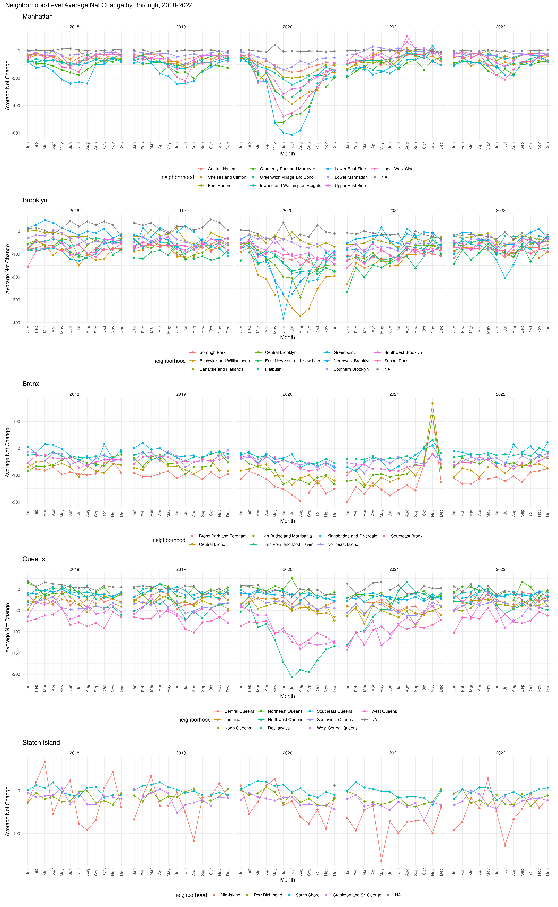

Data Science Midterm
================
Victoria Mello (vsm2118)
October 23, 2023

This analysis uses 2018-2022 Change of Address (COA) data from the US
Postal Service for New York City. The COA data includes information on
the total number of permanent address changes going into and out of each
zipcode in NYC. This report encompasses the data import, cleaning, and
visualization process to examine the net address change trends by
borough over the five years. Dataset limitations are also addressed.

## Section 1 – Data import, cleaning, and quality control

``` r
zip_data = read_csv("zip_codes.csv")
```

    ## Rows: 324 Columns: 7
    ## ── Column specification ────────────────────────────────────────────────────────
    ## Delimiter: ","
    ## chr (4): County Name, County Code, File Date, Neighborhood
    ## dbl (3): State FIPS, County FIPS, ZipCode
    ## 
    ## ℹ Use `spec()` to retrieve the full column specification for this data.
    ## ℹ Specify the column types or set `show_col_types = FALSE` to quiet this message.

``` r
sheet_names <- c("2018", "2019", "2020", "2021", "2022")
coa_data <- map_dfr(sheet_names, ~ readxl::read_xlsx("USPS.xlsx", sheet = .x))

view(coa_data)

coa_data = coa_data %>% 
  janitor::clean_names() %>% 
  mutate(
    year = as.integer(str_sub(month, 1, 4)),
    net_change = `total_perm_in` - `total_perm_out`
  )
```

``` r
# Create a "borough" variable in the ZIP code data
zip_data <- zip_data %>%
  janitor::clean_names() %>% 
  rename(zipcode = zip_code) %>% 
  mutate(
    borough = case_when(
      county_name %in% c("Kings") ~ "Brooklyn",
      county_name %in% c("Queens") ~ "Queens",
      county_name == "Bronx" ~ "Bronx",
      county_name == "New York" ~ "Manhattan",
      county_name == "Richmond" ~ "Staten Island"
    )
  )
  view(zip_data)
```

``` r
# Merge the COA and ZIP code data based on ZIP code
merged_data <- coa_data %>%
  left_join(zip_data, by = "zipcode")

# Select only the necessary variables for later visualizations
final_data <- merged_data %>%
    mutate(
    borough = case_when(
      county_name == "Kings" ~ "Brooklyn",
      county_name == "Queens" ~ "Queens",
      county_name == "Bronx" ~ "Bronx",
      county_name == "New York" ~ "Manhattan",
      county_name == "Richmond" ~ "Staten Island"
    ),
    month = month(month, label = TRUE)
  ) %>%
  select(zipcode, neighborhood, borough, year, month, net_change, city)

# Cleaning zipcodes incorrectly classified for borough
final_data <- final_data %>%
  mutate(borough = case_when(
    zipcode == 10463 ~ "Bronx",
    zipcode == 11201 ~ "Brooklyn",
    zipcode == 11239  ~ "Brooklyn",
    zipcode == 11693 ~ "Queens",
    TRUE ~ borough
  ))  %>% 
  distinct()

view(final_data)
```

Major steps in data wrangling involved importing, cleaning, and merging
datasets. This process included transforming the Change of Address (COA)
data, creating a “borough” variable for zipcode data, merging the
datasets by zipcode, and selecting key variables. Data quality issues
were addressed by reclassifying zipcodes incorrectly classified for
borough and deleting duplicate observations. The resulting tidy dataset
contains a total of 11845 observations. It includes data from 237
zipcodes and data from 43 neighborhoods.

``` r
# Filter the data for Manhattan and Queens
manhattan_data <- final_data %>%
  filter(borough == "Manhattan")

queens_data <- final_data %>%
  filter(borough == "Queens")

# Create tables for the most common cities in Manhattan and Queens
manhattan_table <- manhattan_data %>%
  count(city, sort = TRUE)

queens_table <- queens_data %>%
  count(city, sort = TRUE)

knitr::kable(manhattan_table, caption = "Manhattan most common city value")
```

| city             |    n |
|:-----------------|-----:|
| NEW YORK         | 3477 |
| CANAL STREET     |    4 |
| ROOSEVELT ISL    |    4 |
| ROOSEVELT ISLAND |    4 |
| BOWLING GREEN    |    1 |
| NYC              |    1 |
| SECHEDATY        |    1 |
| WALL STREET      |    1 |

Manhattan most common city value

``` r
knitr::kable(queens_table, caption = "Queens most common city value")
```

| city                |   n |
|:--------------------|----:|
| JAMAICA             | 372 |
| FLUSHING            | 309 |
| ASTORIA             | 230 |
| QUEENS VILLAGE      | 165 |
| BAYSIDE             | 135 |
| LONG ISLAND CITY    | 120 |
| EAST ELMHURST       | 117 |
| OZONE PARK          | 116 |
| FRESH MEADOWS       | 107 |
| FAR ROCKAWAY        | 102 |
| LITTLE NECK         |  79 |
| RIDGEWOOD           |  70 |
| FLORAL PARK         |  68 |
| ELMHURST            |  63 |
| KEW GARDENS         |  62 |
| BELLEROSE           |  60 |
| COLLEGE POINT       |  60 |
| CORONA              |  60 |
| HOWARD BEACH        |  60 |
| REGO PARK           |  60 |
| FOREST HILLS        |  59 |
| HOLLIS              |  59 |
| ROSEDALE            |  59 |
| WOODHAVEN           |  59 |
| WOODSIDE            |  59 |
| CAMBRIA HEIGHTS     |  58 |
| MASPETH             |  58 |
| MIDDLE VILLAGE      |  58 |
| SAINT ALBANS        |  57 |
| ARVERNE             |  56 |
| JACKSON HEIGHTS     |  56 |
| WHITESTONE          |  55 |
| RICHMOND HILL       |  54 |
| GLEN OAKS           |  52 |
| SUNNYSIDE           |  51 |
| ROCKAWAY BEACH      |  49 |
| SOUTH OZONE PARK    |  49 |
| BREEZY POINT        |  47 |
| SOUTH RICHMOND HILL |  47 |
| ROCKAWAY PARK       |  40 |
| DOUGLASTON          |  39 |
| OAKLAND GARDENS     |  38 |
| SPRINGFIELD GARDENS |  30 |
| LAURELTON           |  28 |
| LONG IS CITY        |  19 |
| BRIARWOOD           |  16 |
| ROCKAWAY POINT      |  13 |
| BELLE HARBOR        |  11 |
| GLENDALE            |  11 |
| S RICHMOND HL       |   9 |
| QUEENS VLG          |   8 |
| S OZONE PARK        |   8 |
| BAYSIDE HILLS       |   6 |
| BROAD CHANNEL       |   5 |
| BEECHHURST          |   4 |
| KEW GARDENS HILLS   |   4 |
| NEPONSIT            |   4 |
| AUBURNDALE          |   2 |
| BELLEROSE MANOR     |   2 |
| SPRNGFLD GDNS       |   2 |
| CALVERTON           |   1 |
| CAMBRIA HTS         |   1 |
| JACKSON HTS         |   1 |
| MIDDLE VLG          |   1 |
| NEW YORK CITY       |   1 |
| ST ALBANS           |   1 |

Queens most common city value

#### Data Quality Issues

In the Manhattan table, variations in city names like “NEW YORK” and
“NYC” can lead to inaccurate analysis and visualization, potentially
duplicating or misrepresenting zipcode data. There are also duplicate
city’s and spelling errors among values in city variable.

``` r
# Count the observations for each ZIP code
zip_code_counts <- final_data %>%
  group_by(zipcode, neighborhood, borough, city) %>%
  summarise(Observation_Count = n())
```

    ## `summarise()` has grouped output by 'zipcode', 'neighborhood', 'borough'. You
    ## can override using the `.groups` argument.

``` r
# Filter for ZIP codes with less than 60 observations
zip_count_60 <- zip_code_counts %>%
  filter(Observation_Count < 60) %>%
  arrange(desc(Observation_Count))
```

As shown in the table above there are 188 zipcodes with fewer than 60
observations for change of address. There are various potential factors
that are likely contributing to these specific zipcodes having less
observations. For example, many of these zipcodes are within the midtown
and lower Manhattan neighborhoods, which are characterized by large
business/commercial areas. Zipcodes in these business-centric areas may
be predominantly associated with commercial addresses and PO boxes,
resulting in fewer residential address changes and contributing to
missing neighborhood values. Additionally, many of these zipcodes are
within residential areas of Queens and Brooklyn where property ownership
is more likely, thus these zipcodes may have fewer COAs.

## Section 2 - Exploratory Data Analysis and Visualization

``` r
# Group by borough and year, and calculate the average net_change
average_net_change_table <- final_data %>%
  group_by(borough, year) %>%
  summarize(Average_Net_Change = mean(net_change, na.rm = TRUE)) %>% 
  arrange(borough, year)
```

    ## `summarise()` has grouped output by 'borough'. You can override using the
    ## `.groups` argument.

``` r
average_net_change_table <- average_net_change_table %>%
  rename(`Borough` = borough, `Year` = year, `Average Net Change` = Average_Net_Change)

knitr::kable(average_net_change_table, caption = "This table shows the average net change in addresses by borough and year. The 'Average Net Change' values represent the average address changes for each combination of borough and year. Note that missing values are excluded from the calculations") 
```

| Borough       | Year | Average Net Change |
|:--------------|-----:|-------------------:|
| Bronx         | 2018 |         -46.303333 |
| Bronx         | 2019 |         -48.016667 |
| Bronx         | 2020 |         -72.653333 |
| Bronx         | 2021 |         -66.100000 |
| Bronx         | 2022 |         -53.190000 |
| Brooklyn      | 2018 |         -47.356688 |
| Brooklyn      | 2019 |         -53.182590 |
| Brooklyn      | 2020 |        -113.483402 |
| Brooklyn      | 2021 |         -78.663865 |
| Brooklyn      | 2022 |         -56.651064 |
| Manhattan     | 2018 |         -41.967422 |
| Manhattan     | 2019 |         -52.784773 |
| Manhattan     | 2020 |        -126.434610 |
| Manhattan     | 2021 |         -38.975504 |
| Manhattan     | 2022 |         -46.588055 |
| Queens        | 2018 |         -26.224115 |
| Queens        | 2019 |         -28.713342 |
| Queens        | 2020 |         -47.480106 |
| Queens        | 2021 |         -44.715621 |
| Queens        | 2022 |         -30.368065 |
| Staten Island | 2018 |          -9.846154 |
| Staten Island | 2019 |          -9.125000 |
| Staten Island | 2020 |         -10.544828 |
| Staten Island | 2021 |         -22.548611 |
| Staten Island | 2022 |         -16.298611 |

This table shows the average net change in addresses by borough and
year. The ‘Average Net Change’ values represent the average address
changes for each combination of borough and year. Note that missing
values are excluded from the calculations

Notable trends include a sharp decline in net change values for all
boroughs in 2020, except Staten Island, where this occurred in 2021. In
2020, Manhattan had the most significant decline, followed by Brooklyn,
the Bronx, and Queens. However, Manhattan also displayed the most robust
recovery in 2021.

``` r
lowest_net_change <- final_data %>%
  arrange(net_change) %>%
  head(5) %>%
  select(zipcode, neighborhood, year, month, net_change)

knitr::kable(lowest_net_change, caption = "Lowest Net Change in COA Requests")
```

| zipcode | neighborhood                  | year | month | net_change |
|--------:|:------------------------------|-----:|:------|-----------:|
|   10022 | Gramercy Park and Murray Hill | 2020 | May   |       -983 |
|   10009 | Lower East Side               | 2020 | Jul   |       -919 |
|   10016 | Gramercy Park and Murray Hill | 2020 | Jun   |       -907 |
|   10016 | Gramercy Park and Murray Hill | 2020 | Jul   |       -855 |
|   10009 | Lower East Side               | 2020 | Jun   |       -804 |

Lowest Net Change in COA Requests

``` r
highest_net_change_pre_2020 <- final_data %>%
  filter(year < 2020) %>%
  arrange(desc(net_change)) %>%
  head(5) %>%
  select(zipcode, neighborhood, year, month, net_change)

knitr::kable(highest_net_change_pre_2020, caption = "Highest Net Change in COA Requests Pre-2020")
```

| zipcode | neighborhood        | year | month | net_change |
|--------:|:--------------------|-----:|:------|-----------:|
|   11101 | Northwest Queens    | 2018 | Apr   |        360 |
|   11101 | Northwest Queens    | 2018 | Jun   |        344 |
|   11101 | Northwest Queens    | 2018 | May   |        300 |
|   10001 | Chelsea and Clinton | 2018 | Jul   |        225 |
|   11201 | Northwest Brooklyn  | 2018 | Apr   |        217 |

Highest Net Change in COA Requests Pre-2020

``` r
# Step 1: Filter the data by borough
manhattan_data <- final_data %>% filter(borough == "Manhattan")
brooklyn_data <- final_data %>% filter(borough == "Brooklyn")
bronx_data <- final_data %>% filter(borough == "Bronx")
queens_data <- final_data %>% filter(borough == "Queens")
staten_island_data <- final_data %>% filter(borough == "Staten Island")


# Step 2: Calculate the average net_change values across ZIP codes within neighborhoods for each month and year
manhattan_avg_net_change <- manhattan_data %>%
  group_by(year, month, neighborhood) %>%
  summarize(avg_net_change = mean(net_change)) %>%
  ungroup()
```

    ## `summarise()` has grouped output by 'year', 'month'. You can override using the
    ## `.groups` argument.

``` r
brooklyn_avg_net_change <- brooklyn_data %>%
  group_by(year, month, neighborhood) %>%
  summarize(avg_net_change = mean(net_change)) %>%
  ungroup()
```

    ## `summarise()` has grouped output by 'year', 'month'. You can override using the
    ## `.groups` argument.

``` r
bronx_avg_net_change <- bronx_data %>%
  group_by(year, month, neighborhood) %>%
  summarize(avg_net_change = mean(net_change)) %>%
  ungroup()
```

    ## `summarise()` has grouped output by 'year', 'month'. You can override using the
    ## `.groups` argument.

``` r
queens_avg_net_change <- queens_data %>%
  group_by(year, month, neighborhood) %>%
  summarize(avg_net_change = mean(net_change)) %>%
  ungroup()
```

    ## `summarise()` has grouped output by 'year', 'month'. You can override using the
    ## `.groups` argument.

``` r
staten_island_avg_net_change <- staten_island_data %>%
  group_by(year, month, neighborhood) %>%
  summarize(avg_net_change = mean(net_change)) %>%
  ungroup()
```

    ## `summarise()` has grouped output by 'year', 'month'. You can override using the
    ## `.groups` argument.

``` r
# Step 3: Create separate plots for each borough

manhattan_plot <- manhattan_avg_net_change %>%
  ggplot(aes(x = month, y = avg_net_change, group = neighborhood, color = neighborhood)) +
  geom_line() +
  geom_point() +
  facet_wrap(~year, nrow = 1) +  # Facet by year
  labs(title = "Manhattan", x = "Month", y = "Average Net Change") +
  theme(axis.text.x = element_text(angle = 90, vjust = 0.5, hjust = 1))

brooklyn_plot <- brooklyn_avg_net_change %>%
  ggplot(aes(x = month, y = avg_net_change, group = neighborhood, color = neighborhood)) +
  geom_line() +
  geom_point() +
  facet_wrap(~year, nrow = 1) +  # Facet by year
  labs(title = "Brooklyn", x = "Month", y = "Average Net Change") +
  theme(axis.text.x = element_text(angle = 90, vjust = 0.5, hjust = 1))

bronx_plot <- bronx_avg_net_change %>%
  ggplot(aes(x = month, y = avg_net_change, group = neighborhood, color = neighborhood)) +
  geom_line() +
  geom_point() +
  facet_wrap(~year, nrow = 1) +  # Facet by year
  labs(title = "Bronx", x = "Month", y = "Average Net Change") +
  theme(axis.text.x = element_text(angle = 90, vjust = 0.5, hjust = 1))

queens_plot <- queens_avg_net_change %>%
  ggplot(aes(x = month, y = avg_net_change, group = neighborhood, color = neighborhood)) +
  geom_line() +
  geom_point() +
  facet_wrap(~year, nrow = 1) +  # Facet by year
  labs(title = "Queens", x = "Month", y = "Average Net Change") +
  theme(axis.text.x = element_text(angle = 90, vjust = 0.5, hjust = 1))

staten_island_plot <- staten_island_avg_net_change %>%
  ggplot(aes(x = month, y = avg_net_change, group = neighborhood, color = neighborhood)) +
  geom_line() +
  geom_point() +
  facet_wrap(~year, nrow = 1) +  # Facet by year
  labs(title = "Staten Island", x = "Month", y = "Average Net Change") +
  theme(axis.text.x = element_text(angle = 90, vjust = 0.5, hjust = 1))

# Step 4: Combine the plots using patchwork
library(patchwork)
all_boroughs_plot <- manhattan_plot / brooklyn_plot / bronx_plot / queens_plot / staten_island_plot

all_boroughs_plot <- all_boroughs_plot +
  plot_annotation(title = "Neighborhood-Level Average Net Change by Borough, 2018-2022")

ggsave("results/all_boroughs_plot.png", all_boroughs_plot, width = 16, height = 26, units = "in", bg = "white")
```

<figure>

<figcaption aria-hidden="true">Neighborhood-Level Average Net Change by
Borough, 2018-2022</figcaption>
</figure>

In 2020, all NYC boroughs except Staten Island experienced a decline in
average net change in COAs from April to July, likely due to the onset
of COVID-19. These boroughs did see a recovery from July 2020 onward and
remained relatively stable. The Bronx had a milder dip and notable
spikes in Central Bronx and High Bridge/Morrisania in 2021. Queens also
had a less severe 2020 decline, except for the western neighborhoods.

This dataset is limited in providing a comprehensive understanding of
zipcode-level population changes because it does not account for
variations in the number of individuals residing at each address which
would be necessary for population change estimates.
